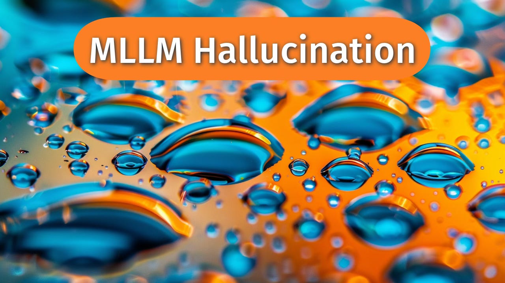

# 🔍 Hallucination Generator

<div align="center">


[](https://www.python.org/downloads/release/python-3120/)
[](https://opensource.org/licenses/MIT)
[](https://openai.com/)

*Generate controlled, categorized hallucinations for vision-language model evaluation*



</div>

---

## 📋 Overview

The Hallucination Generator is a robust toolkit for creating controlled hallucinations in image descriptions, enabling rigorous evaluation and testing of vision-language models. By categorizing hallucinations into distinct types, researchers can systematically assess model performance against specific failure modes.

### ✨ Hallucination Types

| Type | Description | Example |
|------|-------------|---------|
| **🔮 Object** | Adds non-existent but plausible objects to a scene | Adding "a hovering drone" to a park scene |
| **🎨 Attribute** | Changes attributes (colors, sizes, etc.) of existing objects | Changing "red car" to "blue car" |
| **🔄 Relationship** | Misrepresents spatial or interactional relationships | Changing "dog next to person" to "dog on person's lap" |
| **🏙️ Scene** | Misrepresents the overall context or setting | Changing "outdoor beach" to "indoor aquarium" |
| **❓ Irrelevant** | Introduces completely irrelevant or nonsensical details | Adding "the sound of jazz music" to a silent image |

---

## 🚀 Installation

### Prerequisites

- Python 3.12 or higher
- OpenAI API key

### Setup

1. **Clone the repository**

   ```bash
   git clone https://github.com/yourusername/hallucination.git
   cd hallucination
   ```

2. **Create and activate a virtual environment**

   ```bash
   # Using venv (Python's built-in virtual environment)
   python -m venv venv

   # Activate the virtual environment
   # On Windows
   venv\Scripts\activate
   # On macOS/Linux
   source venv/bin/activate
   ```

   Or using conda:

   ```bash
   # Create a new conda environment
   conda create -n hallucination python=3.12
   # Activate the environment
   conda activate hallucination
   ```

3. **Install dependencies**

   ```bash
   pip install -r requirements.txt
   ```

4. **Configure API access**

   Create a `.env` file in the root directory:

   ```env
   OPENAI_API_KEY=your_api_key_here
   ```

---

## 🛠️ Usage

### Quick Start

```bash
python main.py
```

This will:
- Load ground truth descriptions from `hallucination5k_train.jsonl`
- Generate all five types of hallucinations for each description
- Save results to the `generated_hallucinations` directory

### Input Data Format

Your input JSONL file should have this structure:

```json
{"id": "image_001", "value": "A detailed description of the image."}
{"id": "image_002", "value": "Another image description."}
```

### Customization

Edit `main.py` to adjust these parameters:

```python
# Path to your JSONL dataset
DATASET_PATH = 'your_dataset.jsonl'

# Number of samples to process (None for all)
MAX_SAMPLES_TO_PROCESS = 100  

# Output directory
OUTPUT_DIR = "output_folder"  

# LLM settings in call_llm()
model="gpt-4o-mini"
max_tokens=300
temperature=0.5
```

---

## 📊 Output

The tool generates structured outputs for analysis:

### 1. Combined Dataset (JSONL)

```
generated_hallucinations/all_hallucinations.jsonl
```

Contains all hallucination types in a single file with their original descriptions.

### 2. Individual Datasets (CSV)

```
generated_hallucinations/
├── object_hallucinations.csv
├── attribute_hallucinations.csv
├── relationship_hallucinations.csv
├── scene_hallucinations.csv
└── irrelevant_hallucinations.csv
```

Each file includes:
- `identifier`: Image ID
- `question`: The standard prompt
- `ground_truth`: Original description
- `hallucinated_description`: Modified description
- `hallucination_type`: Categorization

---

## 📐 Prompt Engineering

The system uses advanced prompt engineering techniques:

### Key Components

- **Explicit Type Classification**: Each hallucination type has dedicated prompts that prevent type bleeding
- **Few-Shot Learning**: Examples demonstrate the specific hallucination pattern
- **Controlled Quantity**: Prompts specify 2-3 hallucinations per description
- **Rephrasing Instructions**: Text is slightly rephrased while introducing hallucinations

### Example Prompt Structure

```
BASE_INSTRUCTION
Specific Instruction: HALLUCINATION_TYPE_ONLY: Include...

Example:
Input Description: "Original text"
Rephrased description with ONLY multiple X hallucinations: "Example with hallucinations"

---
Now, apply this to the following description:
Input Description: 'User input'
```

---

## 📁 Project Structure

```
hallucination/
├── main.py                               # Main script
├── requirements.txt                      # Dependencies
├── README.md                             # This file
├── .gitignore                            # Git ignore file
├── .env                                  # API keys (not tracked by git)
├── hallucination5k_train.jsonl           # Input data
└── generated_hallucinations/             # Output directory (not tracked by git)
    ├── all_hallucinations.jsonl
    ├── object_hallucinations.csv
    ├── attribute_hallucinations.csv
    ├── relationship_hallucinations.csv
    ├── scene_hallucinations.csv
    └── irrelevant_hallucinations.csv
```

---

## 🔄 Contributing

We welcome contributions to improve the Hallucination Generator!

### Contribution Process

1. Fork the repository
2. Create a feature branch: `git checkout -b feature/amazing-enhancement`
3. Commit your changes: `git commit -am 'Add amazing enhancement'`
4. Push to the branch: `git push origin feature/amazing-enhancement`
5. Open a Pull Request

### Development Guidelines

- Follow the existing code style
- Add tests for new functionality
- Update documentation for any changes
- Ensure all tests pass before submitting PRs

---

## 📄 License

This project is licensed under the MIT License - see the [LICENSE](LICENSE) file for details.

---

## 📞 Contact

For questions, feedback, or collaboration:

- **GitHub Issues**: Open an issue in this repository
- **Email**: ali.cheraghian@data61.csiro.au

---

<div align="center">
<p>Made with ❤️ for VLM research</p>
</div> 